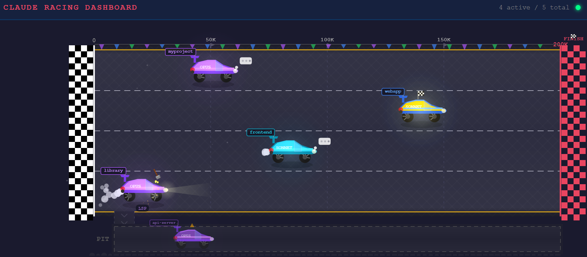

# Agent Racer

A real-time racing visualization of all active Claude Code sessions on your machine. Each session is a car on a racetrack, and its position is driven by context window utilization -- as a conversation consumes more tokens, the car advances toward the finish line.



Sessions are discovered automatically via process scanning. State is read directly from Claude Code's JSONL session files. No configuration, wrappers, or hooks required -- just start Claude Code sessions anywhere on your machine and watch them race.

## How It Works

```
JSONL File Discovery               Go Backend            Browser (Canvas)
 |                                  |                      |
 |-- ~/.claude/projects/*/*.jsonl ->|                      |
 |-- parse token usage ----------->|                      |
 |-- classify activity ----------->|                      |
 |                                  |-- WebSocket -------->|
 |                                  |   snapshots + deltas |
                                    |                      |
                                    |   Canvas renders:    |
                                    |   - Race track       |
                                    |   - Cars per session  |
                                    |   - Particles/FX     |
                                    |   - Detail panel     |
```

**Position = context window fill.** Each API response in Claude Code's session log contains token usage (`input_tokens + cache_read_input_tokens + cache_creation_input_tokens`). That total divided by the model's max context (200K) gives a 0.0-1.0 utilization value that maps to track position. As the conversation grows, the car moves forward. Reaching the limit means the finish line (or compaction time).

## Quick Start

**Prerequisites:** Go 1.22+, a modern browser.

**Localhost-only:** Agent Racer is intended to run on your local machine only. It is not designed or supported for public or multi-user deployment.

```bash
# Clone and run in mock mode (demo with 5 simulated sessions)
cd agent-racer
make dev
# Open http://localhost:8080
```

```bash
# Run with real session monitoring
make run
# Open http://localhost:8080, then start Claude Code sessions in other terminals
```

```bash
# Build a single binary with embedded frontend
make build
./agent-racer --mock    # demo mode
./agent-racer           # real mode
```

## Mock Mode

Mock mode (`--mock`) simulates 5 sessions with distinct behaviors for demo and development:

| Session | Model | Behavior |
|---------|-------|----------|
| **opus-refactor** | Opus | Steady token growth to 180K, completes successfully |
| **sonnet-tests** | Sonnet | Burst pattern (fast writes), completes quickly |
| **opus-debug** | Opus | Stalls mid-conversation (waiting for user input), then resumes |
| **sonnet-feature** | Sonnet | Errors out at ~60% context utilization |
| **opus-review** | Opus | Slow and methodical, heavy tool use (Read, LSP, Grep) |

## Real Mode

In real mode (the default), the dashboard:

1. Scans `~/.claude/projects/*/*.jsonl` for recently updated session files
2. Incrementally parses new JSONL entries each poll (1s interval, only reads new bytes)
3. Extracts token usage, model, activity, and tool calls from the session log
4. Marks sessions complete after a Claude SessionEnd hook (preferred) or a configurable inactivity timeout

### SessionEnd Hook (Recommended)

Agent Racer can use Claude Code's `SessionEnd` hook to mark a session complete immediately and remove the racer after the completion animation.

The install script sets this up automatically:

```bash
./scripts/install.sh
```

If you manage hooks manually, add a `SessionEnd` hook that runs:

```bash
~/.config/agent-racer/hooks/session-end.sh
```

Completion markers are written to `~/.local/state/agent-racer/session-end/` by default (XDG state directory). Configure `monitor.session_end_dir` if you want a different path.

No wrappers, hooks, or environment variables needed. Just run `claude` anywhere and it shows up.

### Multi-Agent Support (Pre-Alpha)

Agent Racer has early support for monitoring OpenAI Codex CLI and Google Gemini CLI sessions alongside Claude Code. This support is **pre-alpha** -- expect bugs with progress tracking, model labels, and session lifecycle. Both sources are disabled by default. To opt in, enable them in your config:

```yaml
sources:
  codex: true
  gemini: true
```

See `docs/multi-agent-guide.md` for detailed documentation on supported CLIs, configuration options, how to add new sources, and a manual validation checklist.

## Visualization

### Cars

Each session is rendered as a car with:

- **Color by model**: Purple = Opus, Blue/Cyan = Sonnet, Green = Haiku
- **Position**: Horizontal position maps to context window utilization (0% to 100%)
- **Name label**: Session name (derived from working directory) above the car
- **Model badge**: Small colored badge showing the model family
- **Token counter**: Current/max tokens below the car (e.g. `142K/200K`)
- **Tool indicator**: Current tool name shown below when actively using a tool

### Activity Animations

| Activity | Visual |
|----------|--------|
| **Thinking** | Car moves with exhaust particles + thought bubble |
| **Tool Use** | Sparks flying + tool name displayed |
| **Waiting** | Hazard lights flashing (amber blinkers) |
| **Idle** | Car stationary, no effects |
| **Churning** | Subtle wheel rotation + occasional exhaust puff (active processing, no output yet) |
| **Complete** | Trophy icon + confetti explosion + victory fanfare |
| **Errored** | Spin-out animation + smoke particles + error sound |
| **Lost** | Car fades to transparent |

*Note: "Starting" state is used only in mock mode for demo purposes.*

### Pit Lane

Idle, waiting, and starting sessions (that aren't churning) automatically roll off the main track into a **pit area** below. This keeps the active racing lanes uncluttered while giving visual persistence to sessions that are still alive but not actively working.

- Cars smoothly animate between track and pit with opacity/scale dimming
- When a session becomes active again (thinking, tool use, or churning), the car drives back onto the track
- Terminal states (complete, errored, lost) stay on track for their exit animations

### Track

- Dark asphalt surface with lane dividers
- Checkerboard start line (0 tokens) and red checkerboard finish line (200K tokens)
- Dotted markers at 50K, 100K, and 150K tokens
- Active sessions get their own lane on the main track
- Pit area below the track holds idle sessions

## Keyboard Shortcuts

| Key | Action |
|-----|--------|
| `D` | Toggle debug panel (shows raw WebSocket messages) |
| `M` | Toggle sound effects (mute/unmute) |
| `F` | Toggle fullscreen |
| `Esc` | Close detail panel |

Click on any car to open the **detail panel** with: activity, token progress bar, model, working directory, message count, tool call count, current tool, timestamps, PID, and session ID.

## Configuration

Agent Racer follows the **XDG Base Directory Specification**. The default config location is:

```
~/.config/agent-racer/config.yaml
```

You can override this with `--config` or set `XDG_CONFIG_HOME` to use a custom config directory.

See `config.example.yaml` for a complete example. Key configuration options:

```yaml
server:
  port: 8080          # HTTP/WebSocket port
  host: "127.0.0.1"   # Bind address (localhost by default)
  # allowed_origins:  # Optional: restrict browser origins for WS
  #   - "http://localhost:8080"
  #   - "http://127.0.0.1:8080"
  # auth_token: ""    # Auto-generated each startup if empty; set to persist

sources:
  claude: true        # Claude Code session monitoring (default: true)
  codex: false        # OpenAI Codex CLI monitoring (default: false, pre-alpha)
  gemini: false       # Google Gemini CLI monitoring (default: false, pre-alpha)

monitor:
  poll_interval: 1s                # How often to scan for processes and read JSONL
  snapshot_interval: 5s            # Full state broadcast interval
  broadcast_throttle: 100ms        # Minimum time between delta broadcasts
  session_stale_after: 2m          # Mark sessions complete after no new data
  completion_remove_after: 8s      # Remove racers after completion animation
  session_end_dir: ""              # Defaults to $XDG_STATE_HOME/agent-racer/session-end
  churning_cpu_threshold: 15.0     # CPU% for detecting active processing
  churning_requires_network: false # Require TCP connections for churning state

models:
  claude-opus-4-5-20251101: 200000
  claude-sonnet-4-5-20250929: 200000
  claude-sonnet-4-20250514: 200000
  claude-haiku-3-5-20241022: 200000
  gpt-5-codex: 272000              # Codex models
  gemini-2.5-pro: 1048576          # Gemini models (1M tokens)
  default: 200000                  # Fallback for unrecognized models

sound:
  enabled: true           # Master enable/disable
  master_volume: 1.0      # 0.0 - 1.0
  ambient_volume: 1.0     # Crowd, wind, engine hums
  sfx_volume: 1.0         # Gear shifts, victory, crashes
  enable_ambient: true
  enable_sfx: true
```

If no config file exists, agent-racer uses sensible defaults. See `docs/configuration.md` for detailed documentation.

## CLI Flags

```
Usage: agent-racer [flags]

  --mock            Use mock session data (demo mode)
  --dev             Serve frontend from filesystem (for development)
  --config string   Path to config file (default: ~/.config/agent-racer/config.yaml)
  --port int        Override server port
```

## API

### WebSocket: `/ws`

Connects to the real-time event stream. Messages are JSON with a `type` field:

**`snapshot`** -- Full state of all sessions (sent on connect and every 5s):
```json
{
  "type": "snapshot",
  "payload": {
    "sessions": [
      {
        "id": "abc-123",
        "name": "my-project",
        "activity": "thinking",
        "tokensUsed": 142000,
        "maxContextTokens": 200000,
        "contextUtilization": 0.71,
        "currentTool": "",
        "model": "claude-opus-4-5-20251101",
        "workingDir": "/home/user/my-project",
        "startedAt": "2026-01-30T10:00:00Z",
        "lastActivityAt": "2026-01-30T10:05:00Z",
        "messageCount": 42,
        "toolCallCount": 18,
        "pid": 12345,
        "lane": 0
      }
    ]
  }
}
```

**`delta`** -- Only changed sessions (throttled to 100ms):
```json
{
  "type": "delta",
  "payload": {
    "updates": [ /* ...session objects... */ ],
    "removed": [ "session-id-1" ]
  }
}
```

**`completion`** -- Session finished:
```json
{
  "type": "completion",
  "payload": {
    "sessionId": "abc-123",
    "activity": "complete",
    "name": "my-project"
  }
}
```

### REST: `GET /api/sessions`

Returns a JSON array of all current session states.

## Architecture

```
agent-racer/
├── Makefile
├── config.yaml
├── backend/
│   ├── go.mod
│   ├── cmd/server/
│   │   └── main.go              # Entry point, flag parsing
│   └── internal/
│       ├── config/config.go      # YAML config loading
│       ├── session/
│       │   ├── state.go          # SessionState, Activity enum
│       │   └── store.go          # Thread-safe session store
│       ├── ws/
│       │   ├── protocol.go       # WebSocket message types
│       │   ├── broadcast.go      # Per-client write channels, throttled broadcasting
│       │   └── server.go         # HTTP/WS handlers
│       ├── monitor/
│       │   ├── source.go         # Unified Source interface for multi-agent support
│       │   ├── claude_source.go  # Claude Code session discovery
│       │   ├── codex_source.go   # OpenAI Codex CLI session discovery
│       │   ├── gemini_source.go  # Google Gemini CLI session discovery
│       │   ├── process.go        # Process scanning via gopsutil
│       │   ├── jsonl.go          # Incremental JSONL parser
│       │   └── monitor.go        # Main poll loop + churning detection
│       ├── mock/
│       │   └── generator.go      # 5 simulated sessions
│       └── frontend/
│           ├── embed.go          # go:embed for production builds
│           └── noembed.go        # Filesystem fallback for dev
└── frontend/
    ├── index.html
    ├── styles.css
    └── src/
        ├── main.js               # Bootstrap, shortcuts, sound, detail panel
        ├── websocket.js           # Auto-reconnecting WebSocket client
        ├── notifications.js       # Browser notifications
        ├── canvas/
        │   ├── Particles.js       # Exhaust, sparks, smoke, confetti
        │   ├── Track.js           # Track rendering with markers
        │   └── RaceCanvas.js      # requestAnimationFrame loop
        └── entities/
            └── Racer.js           # Car entity with activity animations
```

**No build tools for the frontend.** Vanilla JS with ES modules, served directly. The backend is a single Go binary with minimal dependencies (`gorilla/websocket`, `gopsutil`, `yaml.v3`).

**Frontend embedding:** The `frontend/` directory is the single source of truth. During builds (`make build`), it's copied to `backend/internal/frontend/static/` as a build artifact (git-ignored) for Go's embed directive.

## Make Targets

| Target | Description |
|--------|-------------|
| `make dev` | Run mock mode with filesystem frontend (hot-reload friendly) |
| `make run` | Run real mode with filesystem frontend fallback |
| `make build` | Embed frontend into Go binary, produce `./agent-racer` |
| `make dist` | Cross-compile for linux/darwin amd64/arm64 |
| `make test` | Run all Go tests |
| `make clean` | Remove binary and embedded files |
| `make deps` | Download Go dependencies |

## Installing

```bash
# Option 1: Build and install
make build
cp agent-racer /usr/local/bin/

# Option 2: Use the install script
./scripts/install.sh
```

## Requirements

- **Go 1.22+** for building
- **Linux or macOS** for real mode (process discovery via gopsutil)
- Mock mode works on any platform
- Modern browser with Canvas support

## License

[MIT](LICENSE)
